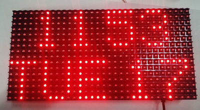
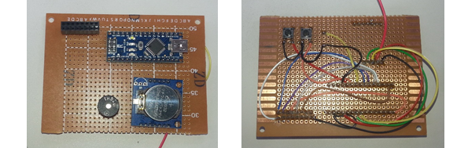
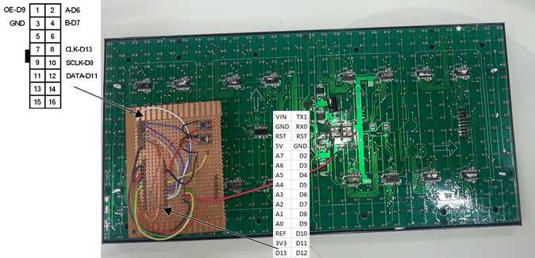
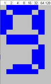

# Arduino Matrix Multi Clock

Here’s an easy to build project which won't get boring. There is some soldering required, but the result is a more robust and permanent design. It also uses the same connections as the [Arduino Pong Project](https://jaycar.com.au/diy-arduino-pong), so you could use the design here to build a more permanent version of Pong.

Looking for another easy to assemble clock project? [Click here](diy-arduino-clock-uno) to view the previous Arduino Clock.

As well as the time and date clock shown above, the clock mode can be changed to show an analog clock, two styles of large digital numbers, a word clock and a binary clock.

## Shopping list:

|Qty| Code | Description |
|---|---|---|
|1 | [XC4414](http://jaycar.com.au/p/XC4414) | duinotech NANO
|1 | [HP9550](http://jaycar.com.au/p/HP9550) | prepunched experimenters board
|1 | [XC4622](http://jaycar.com.au/p/XC4622) | white LED matrix
|1 | [XC4450](http://jaycar.com.au/p/XC4450) | real time clock module
|1 | [HM3207](http://jaycar.com.au/p/HM3207) | arduino compatible stackbale headers
|1 | [SP0601](http://jaycar.com.au/p/SP0601) | micro tactile switch
|1 | [WM4516](http://jaycar.com.au/p/WM4516) | 16 way rainbow ribbon cable

* Alternatives: [XC4621 Red LED Matrix](https://jaycar.com.au/p/XC4621)

## Connections:

Although the assembly of the Experimenter’s board is fiddlier than some other Arduino projects, you’re less likely to have wires fall out. All the components except the LED Matrix are mounted on to the Experimenter’s board, and then the board is mounted to the back of the matrix via the header.

On the top left are two of the 8 way stackable headers from the HM3207 kit, next to the Nano board. Below the Nano is the RTC module. The switches are mounted on the back of the board to be more accessible when it is all assembled. The exact positioning of the boards isn’t critical, as long as everything fits together and doesn’t over hang the edge of the board. If found it easiest to plug the 8 way stackable headers into the matrix, and then fit and solder the headers in place. Note the orientation of the arrows on the back of the matrix relative to the board.

|Nano |DMD |RTC |Button |Function |Colour wire
|---|---|---|---|---|---
|5V |VCC |VCC ||Power |Red
|GND |15 |GND |Pin |Ground |Black
|2 |||Pin |Button |Red
|6 |2 |||Row selector A |Blue
|7 |4 |||Row selector B |Violet
|8 |10 |||Latch |Grey
|9 |1 |||Output Enable |White
|11 |12 |||Serial Data |Brown
|13 |8 |||Serial Clock |Orange
|A4 ||SDA ||RTC Data |Yellow
|A5 ||SCL ||RTC Clock |Green

The best way to construct the project is to press fit all the components onto the Experimenter’s board and check it all fits, then solder in place. Then solder short lengths of wire made from ribbon cable as needed. Note the single red wire that goes to screw terminal in the centre of the board- this can be left disconnected at this stage, as the display will light up without it, but not at full brightness.

Note that in the photos above, I’ve also attached a second button to D3 using an orange wire and a piezo buzzer to D4 using a yellow wire (with the other side of these components going via a black wire to GND). These aren’t necessary for this project, but allow for future features. If you add two joystick modules as per the Arduino Pong instructions, then this hardware can also be used to play Pong if the Pong sketch is uploaded.

## Code:

The code depends on a few libraries to work.

SPI library: for communicating with the Matrix and is included with Arduino IDE.
DMD library: see[DMD-master.zip](https://github.com/freetronics/DMD/archive/master.zip)
TimerOne library: (needed for DMD library to work) see[TimerOne-r11.zip](https://storage.googleapis.com/google-code-archive-downloads/v2/code.google.com/arduino-timerone/TimerOne-r11.zip)

Wire: for I2C communication with the RTC Module and is included with Arduino IDE.
RTClib: for accessing the RTC module. See[RTClib.](https://github.com/adafruit/RTClib/archive/master.zip)

Make sure these libraries are installed before opening the sketch. Note that the sketch consists of five files in the sketch folder. Copy the Arduino_Matrix_Multi_Clock folder into your Arduino documents folder, and all the files should be in the correct place.

## How it works:

The code works by continually reading the time from the RTC module, and after checking the mode variable, displays the appropriate clock face. If the mode button is pressed, then the mode is changed and the display blanked for half a second to acknowledge the change. Each mode has a custom routine for drawing the clock face- the binary clock is very simple, just drawing blocks as needed, while some of the other clocks display text and small bitmaps (the data for which is stored in some of the other tabs).

## Improvements and debugging:

After the code is working, the red wire can be connected to the screw terminal to give full brightness. With it connected, some USB ports may be overloaded preventing sketch uploading. You might find the display is too bright anyway, and leave the red wire disconnected.

If you find the display is working, but the clock doesn’t seem right, try loading the DS1307 sketch from the RTClib/examples folder- this displays the RTC clock time to the serial port (use 57600 baud), and also sets it to the upload time if it isn’t running. Then reload the Matrix Clock sketch.

As mentioned earlier, the connections are similar to the Pong project, so this project could be modified to play Pong by adding two joysticks and the piezo buzzer.

The digital clocks are really only defined by their font data on the sevensegfont.c and font0816.c tabs, so these can be modified to change appearance of the font.

This is how the data is calculated. The value for each row is the total of the value at the top of the lit columns. For example:

* Top row is `62 = 2+4+8+16+32`
* Second row is `93 = 1+4+8+16+64`
* Third row is `99 = 1+2+32+64`

A sheet of grid paper is helpful in working these bitmaps out.

## 3D Printable Bracket:
We've included a 3D printable bracket in the repo folder
